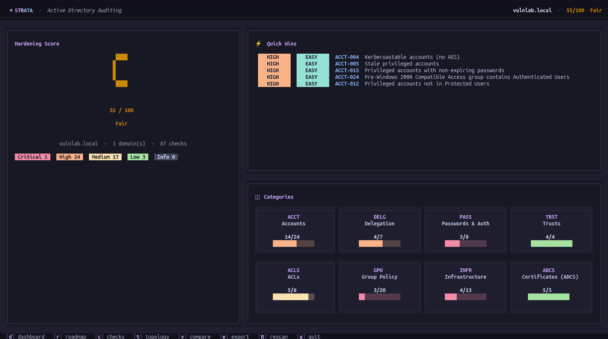
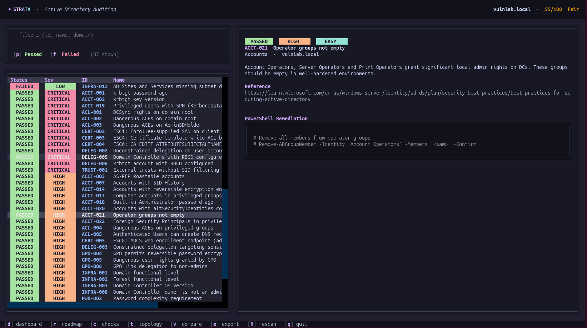
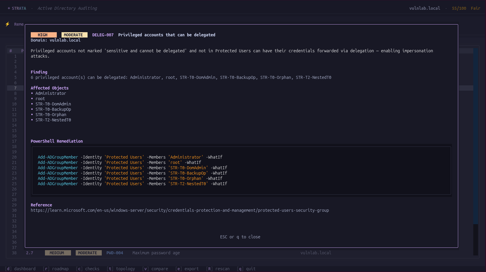
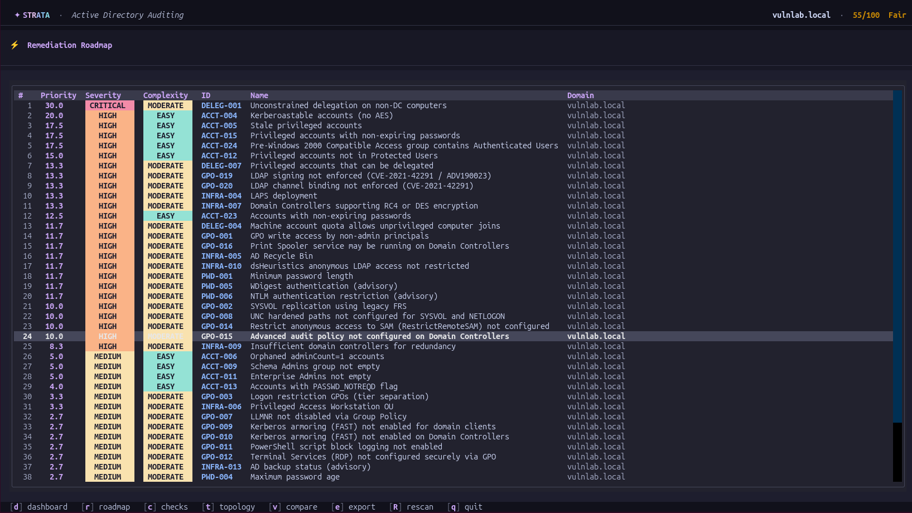
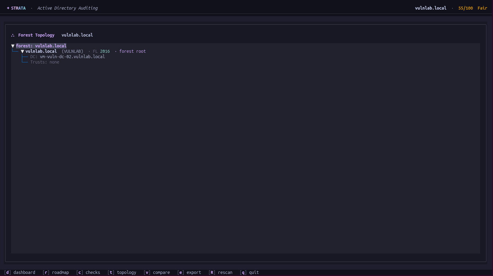

# strata-active-directory-auditing

An Active Directory auditor that runs checks for common misconfigurations and bad practices. Connects to a Domain Controller
via Kerberos GSSAPI (no passwords stored), runs **87 security checks** across 8 categories against every domain in the forest and produces the following:

- HTML report for all checks, remediations and prioritization
- An interactive Terminal TUI with result comparison so you can see the trend
- Exports scan logs, snapshot JSONs for comparison and PowerShell remediation scripts

This tool runs with READ ONLY access to your domain controller, but it is always advisable that you use a dedicated account that is only a member of the Domain Users group. The SMB connections only read from SYSVOL.

## Categories

| Category       | Checks | What it covers                                                       |
| -------------- | -----: | -------------------------------------------------------------------- |
| Accounts       |     24 | Stale privileged accounts, AS-REP / Kerberoast, Protected Users, krbtgt rotation, Pre-Win2000 group, etc. |
| Delegation     |      7 | Unconstrained / constrained / RBCD, MachineAccountQuota, delegatable privileged accounts |
| Passwords      |      8 | Domain policy, fine-grained PSO for service accounts, NTLMv2, anonymous LDAP, WDigest |
| Trusts         |      4 | SID filtering, transitive trusts, MIT trusts, unexpected directions  |
| ACLs           |      6 | DCSync rights, AdminSDHolder, dangerous ACEs on privileged groups, OU protection, DNS zone rights |
| Group Policy   |     20 | LLMNR, hardened UNC paths, Kerberos armoring (FAST), PowerShell logging, RDP/NLA, Defender ASR, RestrictRemoteSAM, audit policy, LDAP signing & channel binding (CVE-2021-42291) |
| Infrastructure |     13 | Functional levels, LAPS, Recycle Bin, RC4/DES on DCs, dsHeuristics, DC count, AD backup status |
| Certificates   |      5 | ADCS ESC1 / ESC2 / ESC3 / ESC4 / ESC6                                |

Each finding carries a **priority score** computed as
`(severity_multiplier × weight) ÷ complexity`, so the Remediation Roadmap
surfaces high-impact, low-effort fixes ("quick wins") first.

## Screenshots

**Dashboard** — forest score, per-category breakdown, and quick-jump tiles.



**Checks** — full filterable list of every check, with severity, status, and category.



**Check detail** — single finding with affected objects, remediation PowerShell, and references.



**Remediation Roadmap** — every failing check sorted by priority score so quick wins surface first.



**Topology** — forest / domain / DC layout discovered during the scan.



## Quick Start

### 1. Install system packages

`gssapi`, `krb5`, and the transitive `cryptography` build against system
libraries — `pip install` will fail without these.

| OS | Packages |
| --- | --- |
| Debian / Ubuntu | `sudo apt install python3-dev libkrb5-dev libffi-dev krb5-user` |
| Fedora / RHEL  | `sudo dnf install python3-devel krb5-devel libffi-devel krb5-workstation` |
| Arch          | `sudo pacman -S krb5 libffi base-devel python` |
| macOS         | `brew install krb5` then `export LDFLAGS="-L$(brew --prefix krb5)/lib"` and `export CPPFLAGS="-I$(brew --prefix krb5)/include"` before `pip install` |

The `krb5-user` / `krb5-workstation` (and macOS `krb5`) package gives you the
`kinit`, `klist`, `kdestroy` CLI tools.

### 2. Clone and install

```sh
git clone https://github.com/Otrivin/strata-active-directory-auditing.git
cd strata-active-directory-auditing
python -m venv .venv
source .venv/bin/activate
pip install -e .
```

### 3. Configure Kerberos

Edit `/etc/krb5.conf` (or create it if missing) and add your forest realm.
The `dns_canonicalize_hostname = false` and `rdns = false` lines are
**important** — without them, cyrus-sasl will rewrite your DC hostname based
on reverse DNS / `/etc/hosts` lookups and request a Kerberos ticket against
the wrong SPN, causing the bind to fail with `No principal in keytab matches
desired name` even though `klist` shows a valid TGT.

```ini
[libdefaults]
    default_realm = YOUR.DOMAIN.LOCAL
    dns_lookup_realm = false
    dns_canonicalize_hostname = false
    rdns = false
    ticket_lifetime = 10h
    forwardable = true

[realms]
    YOUR.DOMAIN.LOCAL = {
        kdc = dc01.your.domain.local
        admin_server = dc01.your.domain.local
    }

[domain_realm]
    .your.domain.local = YOUR.DOMAIN.LOCAL
    your.domain.local = YOUR.DOMAIN.LOCAL
```

If your DC isn't in DNS, add it to `/etc/hosts`:
```
10.0.0.10  dc01.your.domain.local
```
Use **only the FQDN** in the hosts entry (no extra aliases for the same IP)
— extra aliases also confuse cyrus-sasl's canonical-name lookup.

### 4. Get a Kerberos ticket

```sh
kinit user@YOUR.DOMAIN.LOCAL
klist                       # confirm the TGT is valid
```
Use an account with minimum permissions. Member of Domain User is all that the user needs.

### 5. Verify network reachability

```sh
nc -zv dc01.your.domain.local 389    # LDAP
nc -zv dc01.your.domain.local 636    # LDAPS (preferred)
nc -zv dc01.your.domain.local 445    # SMB (for GPO content checks)
```

If LDAPS (636) isn't reachable or the DC has a self-signed cert that you
don't trust, use `--no-ssl` for plain LDAP (lab only — credentials transit
in-the-clear over the network):

```sh
ldapsearch -H ldaps://dc01.your.domain.local -Y GSSAPI -b "" -s base
```

### 6. Run your first scan

```sh
strata scan dc01.your.domain.local           # LDAPS, default
strata scan dc01.your.domain.local --no-ssl  # plain LDAP for labs
strata tui --dc dc01.your.domain.local       # interactive TUI
```

## Usage

```sh
# Headless scan against a Domain Controller
strata scan dc01.your.domain.local

# Lab / unsigned cert
strata scan dc01.your.domain.local --no-ssl --verbose

# Interactive TUI
strata tui --dc dc01.your.domain.local

# Compare two scan snapshots
strata compare results/<old_snapshot>.json results/<new_snapshot>.json
```

Outputs land in `results/<forest>_<timestamp>/`:
- `report.html` — the dashboard (open in any browser)
- `scan.log` — plain-text log + per-check details
- `snapshot.json` — full structured result
- `ps/` — per-finding PowerShell remediation scripts

## TUI keybindings

| Key | Action |
| --- | ------ |
| `d` | Dashboard |
| `r` | Remediation Roadmap |
| `c` | Checks (filterable) |
| `t` | Topology |
| `v` | Compare snapshots |
| `e` | Export (open report / regen artifacts) |
| `R` | Re-scan |
| `q` | Quit |
| `/` | Filter (on Checks screen) |
| `Ctrl+X` | Clear category filter |

Click a category tile on the Dashboard to drill into the checks for that
category.

## References

Each finding in the HTML report links to the relevant Microsoft Learn page.
The overarching guidance is **[AD DS Best Practices for Securing Active Directory](https://learn.microsoft.com/en-us/windows-server/identity/ad-ds/plan/security-best-practices/best-practices-for-securing-active-directory)**.

## Dependencies

A huge thank-you to the maintainers of every library this tool builds on:

| Library | Author / Maintainer | What we use it for |
| ------- | ------------------- | ------------------ |
| **[ldap3](https://github.com/cannatag/ldap3)** | Giovanni Cannata | Read-only LDAP queries with paged controls and Kerberos SASL bind |
| **[gssapi](https://github.com/pythongssapi/python-gssapi)** | Python GSSAPI Project | Kerberos credentials from the local ccache for ldap3 SASL bind |
| **[winacl](https://github.com/skelsec/winacl)** | [@skelsec](https://github.com/skelsec) | Pure-Python parsing of `nTSecurityDescriptor` blobs — used by every ACL check |
| **[smbprotocol](https://github.com/jborean93/smbprotocol)** | [@jborean93](https://github.com/jborean93) (Jordan Borean) | SMB2/3 client for reading GPO `Registry.pol` files from SYSVOL |
| **[krb5](https://github.com/jborean93/pykrb5)** | [@jborean93](https://github.com/jborean93) | Kerberos bindings used by smbprotocol's pyspnego layer for ccache-based auth |
| **[textual](https://github.com/Textualize/textual)** | Textualize | Rich TUI framework — every screen, panel, and widget |
| **[rich](https://github.com/Textualize/rich)** | Textualize | Console rendering, syntax highlighting, status pills |
| **[jinja2](https://github.com/pallets/jinja)** | Pallets | HTML report templating |
| **[click](https://github.com/pallets/click)** | Pallets | CLI argument parsing |


## Security defaults

- **Read-only** — `ldap3` connection is opened with `read_only=True`. SMB
  reads use `GENERIC_READ` and never request write or delete access. No
  WriteDACL, no SetInfo, no DCERPC mutating calls. No CLI tool in this
  project's dependency tree can write to AD.
- **No credentials stored** — auth is via the existing Kerberos ticket
  cache (`KRB5CCNAME` / `/tmp/krb5cc_<uid>`). The tool never prompts for
  passwords and never writes credential material to disk.
- **Outputs are local** — scan results are written to `results/` and
  nothing is sent off-host. The HTML report is fully self-contained
